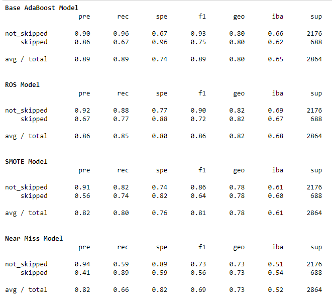
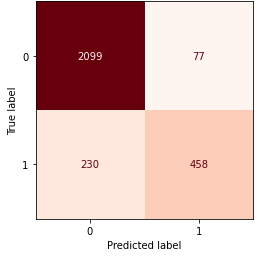

# Would I Skip it?

*Capstone Final Project for DSI -- Data Classification Modeling and Visualization*
 ##### Arink Bertrand

 <h3>Define the Problem</h3>

 When listening to music, one of the main things that will make me skip a song is if the artist sings their own name at the beginning of the track. 

 Searching online I noticed that I am not the only one who cringes when hearing this.  Jason Derulo is one of these artists who has done it so much that someone decided to make a 57 minute long compilation video of Jason Derulo singing his own name.

<a href = 'https://www.youtube.com/watch?v=Ak-OUYwCbmo'> 57 minutes of Jason Derulo singing his own name </a>

| Navigation | Description |
| --- | --- |
| Notebook ||
|  | [Data Acquisition](./1_Data%20Acquisition.ipynb)|
|  | [Data Cleanup](./2_Data%20Cleanup.ipynb)|
|  | [EDA](./3_EDA.ipynb)|
|  | [Models (Start Here)](./4.1.1_Model.ipynb)|
|ReadMe  | |
| | [Define the Problem](#obg)|
| | [Gathering the Data](#gather)|
| | [Cleaning and Target](#clean)|
| | [Data Dictionary](#dict)|
| | [Exploratory Data Analysis](#eda)|
| | [Model](#model)|
| | [Conclusion](#conc)|
| | [Dependencies](#depend)|
| | [What's Next](#next)|
| | [Some Fun Libraries](#fun)|

<h3> Gathering the Data</h3>

I gathered my data by doing API pulls from Spotify and Genius. Initially the tracks/songs were pulled from Playlists created by Spotify. The lyrics for each song was pulled from Genius. It became difficult to pull lyrics from Genius while matching the artist name and song, so I changed my approach to selecting 128 artists and pulling songs with lyrics from each artist. Most artists have 100 tracks in my dataset.

<h3> Cleaning the Data & Setting my Target</h3>

Because I requested 100 tracks from each artists, the likeliness of getting duplicates was set. After Genius iterated though songs for the artist, it attempted to fill the requirements with Remixes or different 'versions', but the lyrics were still the same. An example of this was Fischerspooner's Emerge that appeared 10 times, because there were different Remixes. Although instrumentally they may have been slightly different, lyrically they were the same. 

Other categories that were dropped, were songs that were instrumental only (no lyrics), artists such as Diplo, MGMT had a lot of these, Christina Perri also does lullabies, so there were a few of those in the list as well. 

Once the rows that needed to be dropped were dropped, I moved on to string cleaning, removing line breaks (/n) and unicode that got embedded in the lyrics in the pull. The media column and featured column came in as html dictionaries that were actually strings. I extracted the necessary information from these using Regex, created an alias column to help identify artists in lyrics (Pitbull calls himself Mr. Worldwide and Mr. 305)

To get the target column I would iterate through the lyrics column, and check if any of the values in the Artist, Featured or Aliases columns were in the lyrics, if true the target would be set to 1 if not then 0.

I then called the Spotify API to fill in the release year for the tracks and create a new column for track explicit.

<h3> Data Dictionary</h3>

The Final Dataframe before Vectorizing / Modeling:

|Column|Description|
|---|---|
|artist|Name of Artist on the Track|
|featured|Name of Artists Featured the Track|
|aliases|Other names the Artist or Featured Artists use, includes first name last name split|
|title|Song Title|
|track_id| Spotify Track ID|
|explicit|Boolean whether the song contains explicit content|
|release_year|The year the album containing the track was released|
|lyrics|Song Lyrics|
|Skip|Boolean whether I am likely to skip song based on if artist has sung their own name near the beginning of the track |

<h3> Exploratory Data Analysis</h3>
My target column is unbalanced at 76% 24% split. I also did have some null values remaining, however since I will not be using these columns for modeling, I was not concerned in attempting to fill them. Columns such as Featured and Aliases' null values implied that there were no Featured Artists and the main artist does not go by any aliases.

Prior to count vectorizing my lyrics, I looked at explicit breakdown of the tracks, how the songs that are skipped compare to the data as a whole. Despite there being more non-explicit songs, I skip heavier on the explicits. 

The songs in my dataset range from 1963 to 2020 and the first incidence of an artist naming themselves within the lyrics was in 1984.

I count vectorized the words in the lyrics to see what the most common words are across all the lyrics in the data, for data exploration purposes I added a few variations of vulgar words into my stop words. These words will be left in my model to predict, however they will be masked as 'vulgar'. 

Finally I looked at word sentiment breakdown for each category for their top 200 words.

I found it surprising that I would NOT skip <a href ='https://www.youtube.com/watch?v=oHg5SJYRHA0'> This Song </a>, but I WOULD skip <a href ='https://www.youtube.com/watch?v=oHg5SJYRHA0'> This One. </a> Which only shows that I need to pay better attention to the lyrics.
 

### Steps
- [x] Define the Problem
- [x] Gathering Data
- [x] Cleaning Data & Setting Target
- [x] EDA
- [x] Modeling 
- [x] Conclusion
- [x] Dependencies
- [x] What's Next
- [x] Other Avenues
- [x] Some Fun Libraries

<h3> Modeling&star; </h3> 

I decided to reuse the pipeline function I made for my Reddit NLP to do some modeling with Naive Bayes, Logistic Regression and AdaBoost. Each of these models were instantiated with Count Vectorizer and TFIDF Vectorizer as their transformers. 

The pipeline function puts the models through a GridSearch to find the best parameters, and outputs those parameters, as well as scores.

As part of my pre-processing, as mentioned in my EDA there were some words that I wanted to keep in my model but I masked them instead of leaving them as is. In addition to this modeling notebook, I reran these models in a separate notebook this time, lemmatizing the lyrics to see if the scores would improve.

Of these models the AdaBoost with CV and TFIDF performed the best in both notebooks. AdaBoost with CountVectorizer had the best scores overall:

||Score|
|--|--|
|Train Score |89.48%|
|Test Score | 89.28%
|F1- Train Score |75.42%|
|F1- Test Score |74.89%|
|Precision |85.61%|
|Recall |66.57%|
|Specificity |96.46%|

I then took my best model (Ada Boost with Count Vectorizer) and tried different re-sampling techniques. 

 If I were to pick a re-sampling method it would be the Random Over Sampling(ROS), although it misclassified an additional 186 not skipped songs, it did classify 73 additional skipped songs. SMOTE and NearMiss found more skipped songs, but at higher loss for not skipped songs.  

<b>What's next in my modeling?</b>

- I am currently attempting Neural Networks, being fairly new to this idea, I have to do more research to better understand the hyper-parameters and how to get good results with imbalanced data.

<h3> Road Blocks </h3>

The initial plan was to use the Crowd AI skip prediction challenge dataset (provided by Spotify) to get Spotify user behaviour on skipping habits, however the dataset did not have any track or artist identifiable information. I really wanted to make this work, so I decided to pull all the tracks from playlists made by Spotify and attempt to do a 'backwards' match on Crowd AI's dataset.

<b>Where it went wrong:</b>

- I spent a lot of time pulling the data from Spotify with the idea of matching the user behaviour, once I had all the information Spotify could give me on the tracks (name, title, duration, audio features such as danceability, acoustics etc.) I compared 1 column (duration) frm my gathered data to Crowd AI's dataset, The matches in duration alone were a total of 6k rows, realizing this number would continue decreasing as I matched additional rows, I decided to pivot from this plan and determine what songs I would skip.

- Next, I tried to use the dataset I had already built to add a lyrics column. Using the Genius API and matching the artist and title exactly, proved to be troublesome, and caused lyrics to not be pulled in correctly, or when lyrics were not available it would scrape the entire page, despite except clauses in function. I attempted to fix the issue of miss-matched lyrics, but the options were limited (re-doing the pull made no difference, and manually cleaning it took 3+ hours for 1700 rows. 

<h3> Conclusion </h3> 
Without re-sampling the best model in predicting whether I would skip a track or not, is the AdaBoost with CountVectorizer using DecisionTree as its best estimator. It is ideal to reduce false negatives, (saying a track should be listened to, when it should be skipped)

  

In this case with the training set the model predicted 2099 tracks that were not skipped, 77 tracks that were skipped (but should actually not be), 230 tracks that were not skipped(but should actually be skipped) and 458 tracks that are skipped. Going back to the intent of reducing false negatives, means that as it stands, out of the 2329 tracks that were marked as not skipped tracks (true negatives and false negatives), I will encounter 230 tracks that I should skip. In a world of billions of tracks, It is okay to miss tracks because they were marked as skipped (false positive), rather than encounter the tracks that I would deem 'irritable', as most streaming services stand now, unless you go searching for new tracks, their recommendation playlists are usually the same / similar tracks to what you listen to, so therefore end up missing a lot of tracks that are out there anyways.

<h3> Dependencies </h3>  

- Python 3
- Numpy v.1.18.5
- Pandas v.1.0.5
- Matplotlib v.3.2.2
- Seaborn v.0.10.1
- Plotly v.4.11.0
- time
- lyricsgenius v.2.0.2
- spotipy v.2.16.0
- TextBlob v.0.15.3
- Sklearn v.0.23.1
- imblearn v.0.7.0
- keras v.2.4.3
- tensorflow v.2.3.1
- nltk v.3.5

<h3> What's Next </h3>  
As mentioned above, the next plan is to continue tuning the model using Neural Networks, since I am fairly new to this and don't have a full grasp on the parameters, I will need to do more research and applying to get the predictions to be better than the AdaBoost Model. Once I have a stronger model than I currently have, I would like to continue with my initial plan (Spotify playlist tracks) and see if the model would correctly predict which songs I would skip from Spotify's library. I'd also like to continue to work on Spotify user skip behaviour, to get an insight of how many users skip songs for this particular reason.

<h3> Fun Libraries </h3>  
In addition to the usual libraries that make our Data Science world spin, I found these libraries to be very useful in this Capstone:

-   <a href='https://pypi.org/project/email-notify-magic/'> Email Notify Magic </a>
    - Used for long running cells, will send you an email when cell has completed running.
- <a href='https://pypi.org/project/lyricsgenius/'> LyricsGenius </a>
    - Makes Genius API pulls easy
- <a href='https://spotipy.readthedocs.io/en/2.16.0/'> Spotipy </a>
    - Lightweight Python library for Spotify Web API    
